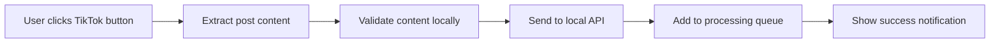
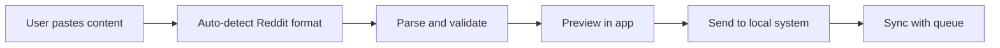
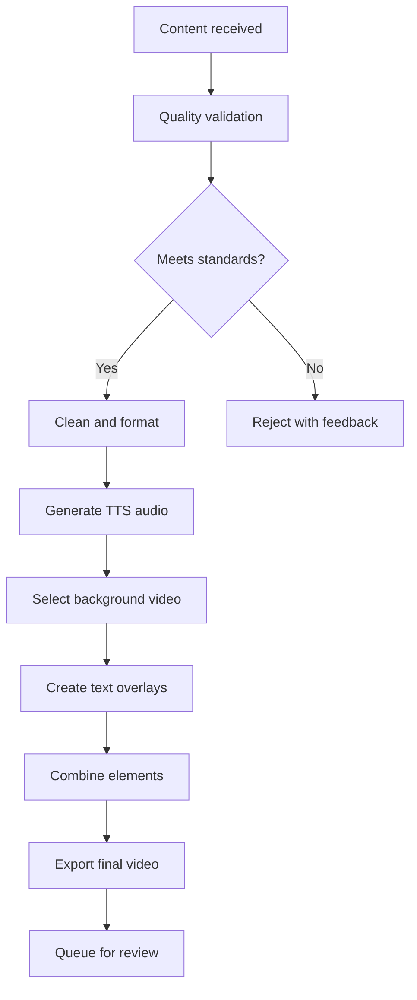

# Reddit-to-TikTok Automation System: Complete Development Specification

## Project Overview

**Objective**: Create a streamlined system that enables content creators to efficiently convert Reddit stories into TikTok-ready videos through manual content curation and automated video production.

**Core Philosophy**: Bypass web scraping and API limitations by using manual content selection with automated video generation, ensuring legal compliance while maintaining quality control.

## System Architecture

### High-Level Workflow
1. **Content Discovery**: User browses Reddit normally via browser or mobile app
2. **Manual Content Input**: User copy-pastes selected content into local processing system
3. **Content Processing**: Local system validates, cleans, and enhances content
4. **Video Generation**: Automated pipeline creates TikTok-ready videos
5. **Review & Publishing**: User reviews and approves final videos

### Phase 1 MVP Architecture (Manual Copy-Paste Focus)
```
[Reddit Browser] → [Manual Copy] → [Local Processing System] → [Video Output]
     ↓                    ↓                    ↓                    ↓
   User browses      Copy-paste text    Content validation     MP4 videos
   finds content     into interface     TTS generation         ready for
   manually          for processing     Video assembly         TikTok upload
```

### Future Enhanced Architecture (Phases 2-4)
```
[Reddit] → [Browser Extension] → [Local API] → [Video Generation] → [TikTok]
    ↓            ↓                     ↓              ↓               ↓
[Mobile] → [Mobile App] → [Queue Management] → [Batch Processing] → [Review]
```

### Core Components

#### 1. Manual Content Input System (Phase 1 Priority)
- **Purpose**: Simple interface for manual Reddit content processing
- **Functionality**: 
  - Command-line or basic GUI for text input
  - Real-time content validation and quality scoring
  - Direct pipeline to video generation
  - Local file management and organization
  - Processing status feedback

#### 2. Video Generation Engine (Phase 1 Priority)  
- **Purpose**: Automated video creation from text content
- **Functionality**:
  - Text-to-speech generation with multiple provider support
  - Background video selection and management
  - Text overlay with precise timing synchronization
  - TikTok format optimization and export
  - Quality control and validation

#### 3. Mobile App (Phase 3 - Future Enhancement)
- **Purpose**: Capture content from Reddit mobile app via copy-paste
- **Functionality**:
  - Rich text input area with smart Reddit formatting detection
  - Content validation and quality scoring
  - Queue management with preview capabilities
  - Direct integration with video generation pipeline
  - Offline queue storage for later processing

#### 4. Browser Extension (Phase 4 - Optional Enhancement)
- **Purpose**: Add "Send to TikTok Bot" button to Reddit posts
- **Functionality**: 
  - Inject button into Reddit post interface
  - Extract post title, body, upvotes, comments count
  - Send data to local processing queue via API
  - Visual feedback for successful captures
  - Settings panel for content filters

#### 5. Upload Queue & Scheduling System (Phase 2 Priority)
- **Purpose**: Automated posting to multiple platforms with optimal timing
- **Functionality**:
  - Multi-platform upload queue (TikTok, YouTube Shorts, Instagram Reels)
  - Optimal timing algorithms based on audience analytics
  - Platform-specific optimization and formatting
  - Automated posting with fallback mechanisms
  - Cross-platform performance tracking

#### 6. Desktop GUI Application (Phase 3 Enhancement)
- **Purpose**: Enhanced interface for content management and video review
- **Functionality**:
  - Content queue visualization
  - Video preview and approval workflow
  - Batch processing controls
  - Settings and configuration management
  - Publishing dashboard with analytics

## Technical Specifications

### Upload Queue & Scheduling System Technical Details

**Technology Stack**: Python 3.8+ with scheduling libraries (APScheduler), platform APIs
**Purpose**: Maximize reach through optimal timing and multi-platform distribution

**Core Features for Phase 2**:

**Platform Integration**:
```python
class PlatformUploader:
    def __init__(self):
        self.tiktok_api = TikTokAPI()
        self.youtube_api = YouTubeAPI() 
        self.instagram_api = InstagramAPI()
    
    def upload_to_platform(self, video_path, platform, metadata):
        """Upload video with platform-specific optimizations"""
        if platform == "tiktok":
            return self.upload_tiktok(video_path, metadata)
        elif platform == "youtube_shorts":
            return self.upload_youtube_shorts(video_path, metadata)
        elif platform == "instagram_reels":
            return self.upload_instagram_reels(video_path, metadata)
```

**Optimal Timing Algorithm**:
```python
class OptimalTiming:
    def __init__(self):
        self.platform_data = {
            "tiktok": {
                "peak_times": ["6-9am", "7-11pm"],
                "best_days": ["tuesday", "wednesday", "thursday"],
                "timezone": "EST"
            },
            "youtube": {
                "peak_times": ["2-4pm", "8-11pm"], 
                "best_days": ["thursday", "friday", "saturday"],
                "timezone": "EST"
            }
        }
    
    def get_next_optimal_slot(self, platform, current_time):
        """Calculate next optimal posting time for platform"""
        pass
    
    def schedule_content(self, video_queue, platforms):
        """Distribute content across platforms with optimal timing"""
        pass
```

**Queue Management System**:
```python
class UploadQueue:
    def __init__(self):
        self.pending_uploads = []
        self.scheduled_uploads = []
        self.completed_uploads = []
    
    def add_to_queue(self, video_data, platforms, priority="normal"):
        """Add video to upload queue with platform specifications"""
        pass
    
    def process_queue(self):
        """Process scheduled uploads when timing is optimal"""
        pass
    
    def handle_failed_uploads(self, failed_upload):
        """Retry logic for failed uploads"""
        pass
```

**Platform-Specific Optimizations**:

**TikTok Specifications**:
- Resolution: 1080x1920 (9:16 aspect ratio)
- Duration: 15 seconds - 10 minutes
- File size: Maximum 287MB
- Format: MP4, MOV
- Hashtags: 3-8 optimal, avoid spam detection
- Captions: 2,200 character limit

**YouTube Shorts Specifications**:
- Resolution: 1080x1920 (9:16 aspect ratio) 
- Duration: Maximum 60 seconds
- File size: Maximum 256GB or 12 hours
- Format: MP4, MOV, AVI, WMV, FLV, WebM
- Title: Include "#Shorts" for algorithm recognition
- Thumbnails: Auto-generated or custom upload

**Instagram Reels Specifications**:
- Resolution: 1080x1920 (9:16 aspect ratio)
- Duration: 15-90 seconds optimal
- File size: Maximum 4GB
- Format: MP4, MOV
- Cover image: Custom thumbnail support
- Audio: Support for Instagram music library

**Key Features for Implementation**:
- Automated format conversion for each platform
- Platform-specific metadata optimization
- Failure recovery and retry mechanisms
- Cross-platform analytics aggregation
- Content calendar visualization
- A/B testing for posting times

### Mobile App Technical Details

**Platform**: Cross-platform (iOS/Android)
**Technology Stack**: React Native or Flutter
**Key Features**:
- Intelligent paste detection for Reddit content
- Offline content queue with sync capabilities
- Push notifications for processing updates
- Integration with device TTS for preview
- Share sheet integration for direct Reddit sharing

**Core Screens**:
- **Content Input**: Smart paste area with formatting detection
- **Queue Management**: List of pending/processed content
- **Settings**: API endpoints, quality thresholds, export preferences
- **Preview**: Video preview and approval interface

### Local Processing Engine Technical Details

**Technology Stack**: Python 3.8+, FastAPI, FFmpeg, OpenAI/ElevenLabs APIs
**Architecture**: Microservice-based with clear separation of concerns

**Core Modules**:

#### Content Processing Module
```python
class ContentProcessor:
    def validate_content(self, raw_text: str) -> ContentValidation
    def clean_reddit_formatting(self, text: str) -> str
    def extract_metadata(self, content: dict) -> ContentMetadata
    def assess_quality_score(self, content: str) -> float
    def estimate_video_duration(self, content: str) -> int
```

#### Text-to-Speech Module
```python
class TTSEngine:
    def generate_audio(self, text: str, voice_id: str) -> AudioFile
    def optimize_for_video(self, audio: AudioFile) -> AudioFile
    def add_emotional_inflection(self, text: str, emotion: str) -> str
```

#### Video Generation Module
```python
class VideoGenerator:
    def create_background_video(self, duration: int, style: str) -> VideoFile
    def add_text_overlay(self, video: VideoFile, text: str, timing: list) -> VideoFile
    def combine_audio_video(self, video: VideoFile, audio: AudioFile) -> VideoFile
    def export_tiktok_format(self, video: VideoFile) -> VideoFile
```

**API Endpoints**:
- `POST /api/content/submit` - Receive content from extension/mobile
- `GET /api/content/queue` - Retrieve processing queue
- `POST /api/video/generate` - Trigger video generation
- `GET /api/video/status/{id}` - Check processing status
- `POST /api/video/approve` - Mark video as approved for publishing

### Desktop GUI Application Technical Details

**Technology Stack**: Electron with React or Python Tkinter
**Purpose**: Central control hub for power users

**Key Features**:
- Real-time queue monitoring with WebSocket updates
- Drag-and-drop content management
- Batch processing with progress tracking
- Video preview with frame-by-frame scrubbing
- Export controls for multiple platforms
- Analytics dashboard for content performance

## Content Processing Pipeline

### Stage 1: Content Validation
**Criteria**:
- Word count: 150-500 words (optimal for 60-90 second videos)
- Completeness: Full story with beginning, middle, end
- Appropriateness: No explicit content, doxxing, or harmful material
- Engagement potential: Emotional hooks, relatable scenarios
- Technical suitability: No excessive formatting, links, or images

**Quality Scoring Algorithm**:
```python
def calculate_quality_score(content):
    score = 0.0
    
    # Length optimization (target: 200-400 words)
    word_count = len(content.split())
    if 200 <= word_count <= 400:
        score += 0.3
    elif 150 <= word_count <= 500:
        score += 0.2
    
    # Emotional engagement detection
    emotional_words = count_emotional_indicators(content)
    score += min(emotional_words * 0.1, 0.3)
    
    # Story structure completeness
    if has_clear_narrative_structure(content):
        score += 0.2
    
    # Readability and TTS optimization
    if is_tts_friendly(content):
        score += 0.2
    
    return min(score, 1.0)
```

### Stage 2: Content Enhancement
**Text Processing**:
- Remove Reddit-specific formatting (AITA, Edit:, Update:)
- Expand abbreviations for TTS clarity
- Add natural pauses and emphasis markers
- Generate engaging hooks and conclusions
- Create platform-specific variations

**Emotional Analysis**:
- Detect primary emotion (anger, sadness, joy, surprise)
- Select appropriate background music and visuals
- Adjust TTS voice parameters for emotional consistency
- Generate emotion-appropriate thumbnails

### Stage 3: Video Generation
**Audio Production**:
- Text-to-speech with emotional inflection
- Background music selection based on story emotion
- Audio mixing and mastering for mobile consumption
- Generate multiple voice variations for A/B testing

**Visual Production**:
- Select background videos from categorized library
- Generate animated text overlays with precise timing
- Create eye-catching thumbnails with emotion-based design
- Ensure TikTok format compliance (1080x1920, 30fps, <3MB)

## Integration Workflows

### Browser Extension → Local System


### Mobile App → Local System


### Local Processing Flow


## Configuration and Customization

### Content Filters
**Subreddit Preferences**:
- Primary targets: r/AmITheAsshole, r/relationship_advice, r/tifu
- Secondary sources: r/MaliciousCompliance, r/ProRevenge
- Quality thresholds per subreddit
- Blacklist for inappropriate communities

**Content Quality Settings**:
- Minimum/maximum word counts
- Required emotional engagement score
- Story completeness requirements
- Language and profanity filters

### Video Generation Settings
**Audio Configuration**:
- Primary TTS provider (OpenAI/ElevenLabs/Google)
- Voice selection and gender preferences
- Speech rate and emotional range
- Background music volume levels

**Visual Configuration**:
- Background video categories and preferences
- Text overlay styling (fonts, colors, positioning)
- Thumbnail generation templates
- Platform-specific format optimizations

### Output Management
**File Organization**:
```
output/
├── pending_review/     # Videos awaiting approval
├── approved/          # Ready for publishing
├── published/         # Archive of posted content
├── rejected/          # Failed quality checks
└── assets/
    ├── backgrounds/   # Background video library
    ├── audio/        # Generated TTS files
    └── thumbnails/   # Generated thumbnail images
```

**Metadata Tracking**:
- Source Reddit post URL and metadata
- Processing timestamps and duration
- Quality scores and approval status
- Performance metrics post-publishing

## Development Roadmap

### Phase 1: MVP Manual System (Weeks 1-2) **[PRIORITY]**
- Simple command-line or basic GUI for manual content input
- Core content validation and quality scoring
- Basic TTS integration with OpenAI/ElevenLabs
- Simple video generation pipeline (text + background + audio)
- File management for generated videos

### Phase 2: Enhanced Manual Interface & Upload Queue (Weeks 3-5)
- Improved desktop GUI with content preview
- **Multi-platform upload scheduling system**
- **Optimal timing algorithms and queue management**
- Text overlay system with timing synchronization
- TikTok format optimization and export
- **YouTube Shorts and Instagram Reels formatting**
- Cross-platform analytics integration

### Phase 3: Mobile Integration (Weeks 6-7)
- Cross-platform mobile app for copy-paste workflow
- Content input and validation interface
- Queue synchronization with local system
- Preview and approval workflows

### Phase 4: Browser Extension (Weeks 8-9) **[OPTIONAL]**
- Chrome extension with content injection
- Reddit post extraction and parsing
- Local API integration and error handling
- User interface and settings panel

### Phase 5: Advanced Features (Weeks 10-11)
- Advanced dashboard for content management
- A/B testing capabilities for hooks and styles
- Performance analytics across platforms
- Automated trend detection and content suggestions

### Phase 6: Polish and Scale (Weeks 12-13)
- Performance optimization and bug fixes
- Advanced customization options
- Documentation and user guides
- Distribution and deployment preparation

## Success Metrics and KPIs

### Technical Performance & Multi-Platform KPIs
- Content processing time: <2 minutes per video
- Platform format conversion: <30 seconds per platform
- Upload success rate: >95% across all platforms
- Optimal timing accuracy: Hit peak windows 90%+ of time
- System uptime: >99% availability
- Cross-platform sync: <5 second delay between uploads

### Content Quality & Engagement
- Video approval rate: >90% of generated videos
- Average engagement rate: Competitive with manual creation across platforms
- Content diversity: Multiple emotions and story types
- Platform compliance: 100% format adherence for all platforms
- Cross-platform performance: Track relative engagement rates

### User Experience & Automation
- Time from content discovery to scheduled upload: <5 minutes
- Queue management efficiency: Handle 50+ videos simultaneously
- Upload automation reliability: 95%+ successful scheduled posts
- Multi-platform configuration: One-click setup for all platforms
- Performance analytics: Real-time cross-platform metrics

## Risk Mitigation

### Legal Compliance
- No automated Reddit access or API violations
- Clear content attribution and source crediting
- User responsibility for content selection and posting
- Compliance with TikTok community guidelines

### Technical Risks
- Offline-first design for system reliability
- Local processing to avoid cloud dependencies
- Graceful degradation when services are unavailable
- Comprehensive error handling and user feedback

### Content Quality Risks
- Multi-stage validation pipeline
- Human review requirement for final approval
- Continuous improvement based on user feedback
- Quality metrics tracking and optimization

This specification provides a complete blueprint for creating a robust, legally compliant, and user-friendly Reddit-to-TikTok content automation system that balances efficiency with quality control.